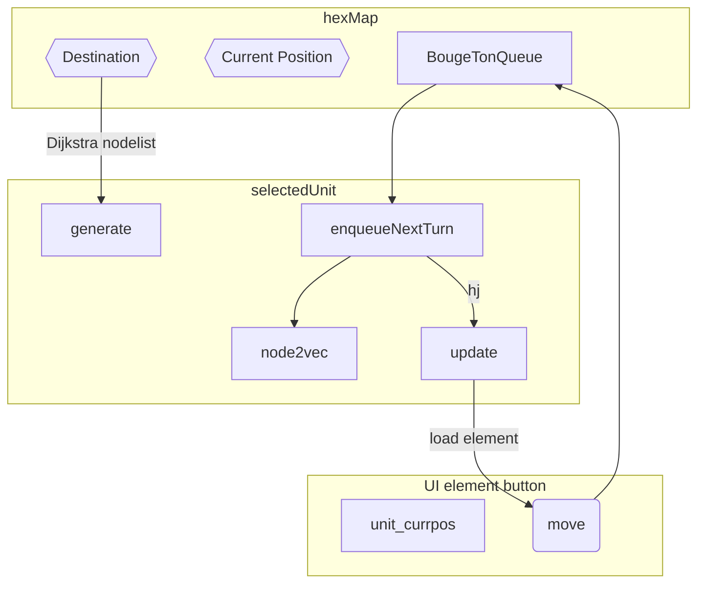

```mermaid
graph TD
  subgraph hexMap
    hex_dest{{Destination}}
    hex_curr{{Current Position}}
    BougeTonQueue
  end
  subgraph UI element button
    unit_currpos
    button(move)
  end

  subgraph selectedUnit
    enqueueNextTurn
    generate
    update
    enqueueNextTurn
    node2vec
  end
  hex_dest --> |Dijkstra nodelist| generate
  update -->|load element| button
  button --> BougeTonQueue --> enqueueNextTurn
  enqueueNextTurn --> node2vec
  enqueueNextTurn --> |hj| update

```
